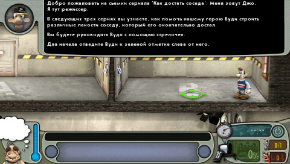
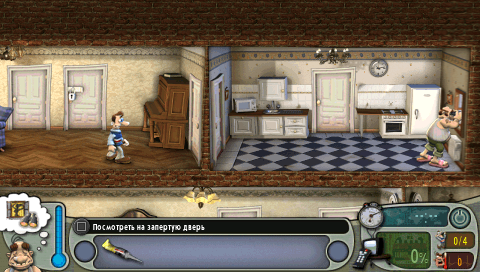

ВНИМАНИЕ: ФАНАТСКИЙ ПРОЕКТ

Все права на игру "Neighbours from Hell" принадлежат THQ Nordic.
Проект не связан с THQ Nordic и не одобрен компанией.
Автор не претендует на права на оригинальные игровые ресурсы.

<p>
    
    
</p>

## Как собрать
1. Установите [PSPSDK](https://pspdev.github.io/installation.html)
2. Склонируйте репозиторий в вашу папку при помощи команды:
```bash
git clone https://github.com/dntrnk/Neighbours-from-Hell-PSP
```
3. Откройте папку в терминале и запустите сборку:
```bash
make clean && make
```
4. Скопируйте папку `build/`, переименуйте по желанию и перенесите в `F:/PSP/GAME/`
