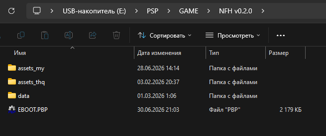

# Как достать соседа (PSP)

ВНИМАНИЕ: ФАНАТСКИЙ ПРОЕКТ

Все права на оригинальную игру "Neighbours from Hell" принадлежат THQ Nordic.
Проект не связан с THQ Nordic и не одобрен компанией.
Автор не претендует на права на оригинальные игровые ресурсы.

<p>
    
    
</p>

## Как установить
- Скачайте последнюю версию во вкладке [Releases](https://github.com/dntrnk/Neighbours-from-Hell-PSP/releases)
- Распакуйте архив
- Перенесите распакованную папку в `PSP/GAME/`. Структура должна выглядеть так:
<p>
    
</p>

## Как собрать
- Установите [PSPSDK](https://pspdev.github.io/installation.html)
- Получите исходный код одним из способов:
  - **Стабильный релиз:** скачайте архив `Source code` желаемой версии со страницы [Releases](https://github.com/dntrnk/Neighbours-from-Hell-PSP/releases)
  - **Nightly (последний коммит):** склонируйте репозиторий командой:
    ```bash
    git clone https://github.com/dntrnk/Neighbours-from-Hell-PSP
    ```
    > **Внимание:** Nightly-версия содержит самые последние изменения, которые ещё не вошли в релиз. Код может быть нестабильным или находиться в процессе доработки.
- Откройте папку в терминале и запустите сборку:
```bash
make clean && make
```
- Скопируйте папку `build/`, переименуйте по желанию и перенесите в `PSP/GAME/`
